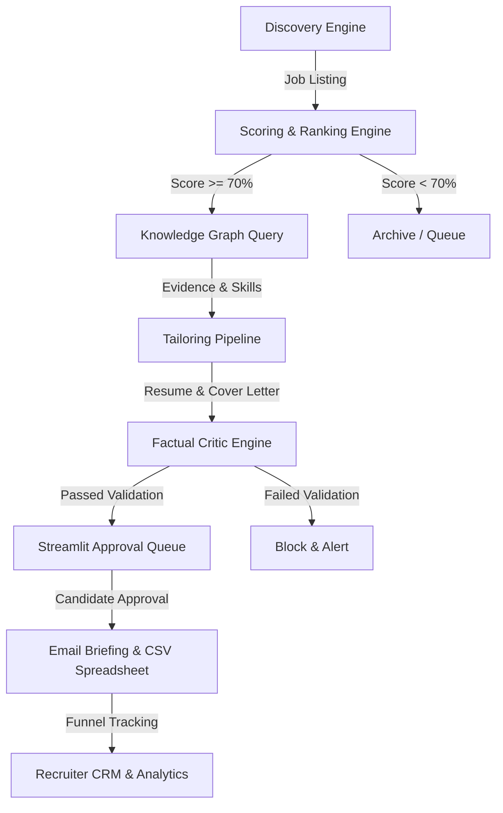

# 🚀 JobHunterAI: Career Intelligence Platform & Recruitment Operating System

<div align="center">

[](https://python.org)
[](https://www.docker.com)
[](https://firebase.google.com)
[](https://opensource.org/licenses/MIT)

</div>

---

## 🏛️ V10 Executive Architecture

JobHunterAI is an enterprise-grade **Career Intelligence Platform & Recruitment Operating System** designed to maximize the probability of securing high-quality remote offers. Unlike simple "auto-apply" spam bots, JobHunterAI focuses on **conversion, credibility, and traceability**.



---

## 🎨 UI/UX Design System: Claymorphism + Brutalism

The platform's frontend combines **Brutalist structural accents** with **Claymorphic control elements** to deliver a premium, high-contrast dashboard experience:

| Accent / Control | Style Specification | Tailwind / CSS Configuration |
| :--- | :--- | :--- |
| **Brutalist Cards** | Thick borders & offset hard shadows | `border-4 border-black shadow-[6px_6px_0px_0px_rgba(0,0,0,1)]` |
| **Brutalist Buttons** | Interactive translation on hover | `hover:translate-x-[2px] hover:translate-y-[2px] transition-all` |
| **Claymorphic Widgets** | Inset soft gradients & rounded shapes | `shadow-[inset_0_2px_4px_rgba(255,255,255,0.6)] rounded-3xl` |
| **Typography** | Sans-serif structural fonts | Outfit / Inter (Google Fonts) |
| **Color System** | High-contrast accent blocks | Indigo (`#4F46E5`), Deep Black, Off-White, Purple |

---

## 📂 Project Structure

```text
JobHunterAI/
│
├── config.py                 # System configuration, dotenv loading, API key config
├── orchestrator.py           # Pipeline Orchestrator coordinating deterministic & LLM stages
├── app.py                    # Streamlit Dashboard UI (approval gate, graph explorer, analytics)
├── main.py                   # CLI entrypoint for discovery and local compilation
├── Dockerfile                # System LaTeX environment containerization
├── docker-compose.yml        # Web and background task orchestrations
│
├── docs/                     # Platform Documentation & Directives
│   ├── 01_vision.md          # Core Funnel vision & Discovery Universe
│   ├── 16_deployment.md      # Cloud Deployment & DevOps Guide
│   └── EXECUTION_DIRECTIVE.md # V10 Executive Operating Directive
│
├── prompts/                  # Prompt Registry (Markdown files)
│   ├── job_analysis.md
│   ├── ats_optimizer.md
│   ├── resume_generator.md
│   ├── critic.md
│   ├── cover_letter.md
│   ├── networking.md
│   └── interview.md
│
├── storage/                  # Database management (SQLite + SQLAlchemy 2.0)
│   ├── db.py                 # Database engine & tables
│   ├── crud.py               # Graph traversal queries & transactional CRUD operations
│   └── seed.py               # Seeds candidate profile and evidence logs
│
├── models/                   # Pydantic validation schemas
│   └── schemas.py            # Pydantic schemas (Job, Project, Candidate)
│
├── engines/                  # Independent functional modules
│   ├── discovery.py          # Scrapes Greenhouse, Lever, and YC postings
│   ├── company_intel.py      # Researches company stage, tech stack, and YC status
│   ├── ranking.py            # Deterministic job scoring and project ranking
│   ├── compiler.py           # Resumes compiler (Jinja2 LaTeX) & cover letter compiler
│   ├── ats.py                # ATS optimization checks & iterative loop
│   ├── critic.py             # Truth validator (Programmatic Rule Engine + LLM verification)
│   ├── networking.py         # outreach generator (LinkedIn notes)
│   ├── interview.py          # STAR interview prep generator
│   ├── analytics.py          # CRM funnel metrics and offer comparisons
│   └── notifications.py      # Compiled HTML briefings & CSV daily spreadsheet generator
│
├── templates/                # LaTeX and Markdown formatting layouts
│   ├── backend.tex
│   └── cover_letter.md
│
└── tests/                    # Automated testing suite
    └── test_pipeline.py      # Relational graph validation & pipeline tests
```

---

## 💾 Relational Knowledge Graph Schema

The database uses **SQLAlchemy 2.0** to model candidate records as a connected graph:
- **`Candidate`**: Roots the profile details.
- **`Experience`**: Traditional corporate jobs or open-source roles.
- **`Project`**: Engineering products built.
- **`Skill`**: Candidate tech stack mapped to relevant projects.
- **`Evidence`**: Verified links (PRs, commits, issues, docs, deployments) connected directly to projects/experiences to back up resume bullets.
- **`STARStory`**: Interview scenarios matching experiences.
- **`JobOpportunity`**: Tracks scraped positions and viability scores.
- **`Application`**: Relates jobs, resumes, outreach letters, and conversion statuses.
- **`RecruiterCRM`**: Tracks recruiters and conversation logs.

---

## 🛡️ Programmatic Rule Engine & Truth Validation

To prevent AI hallucination or exaggeration:
1. **The ADEN Rule**: Any experience marked `is_open_source=True` (like ADEN contribution) is hard-locked to the role **"Open Source Contributor"**. The pipeline fails if the LLM attempts to rename it or claim core employment status.
2. **Metadata Integrity**: Experience dates, titles, and companies are immutable.
3. **Traceability**: Every tailored bullet point must map back to a database-verified evidence record (e.g. PR #142, Commit 3ea92b) or it is flagged.

---

## ⚡ Setup & Usage

### 1. Requirements
Ensure you have Python 3.12+ installed. Install dependencies:
```bash
pip install -r requirements.txt
```

### 2. Configure Environment Variables
Copy `.env.example` to `.env` and fill in your API keys and SMTP credentials. If no keys are provided, JobHunterAI defaults to **Offline Mode**, using local mock text engines to compile the files.

### 3. Initialize & Seed Database
Build the tables and seed candidate graph data:
```bash
python storage/seed.py
```

### 4. CLI Execution
- **Run the daily loop** (discovers jobs, ranks them, tailors matches, compiles CSV, sends email):
  ```bash
  python main.py --daily-loop
  ```
- **Ingest a live Greenhouse / Lever / Ashby URL**:
  ```bash
  python main.py --url https://jobs.lever.co/stripe/senior-backend-engineer
  ```

### 5. Launch Dashboard Web Interface
Run the dashboard to browse the Match Queue, review resume drafts, check analytics, and manage CRM contacts:
```bash
streamlit run app.py
```
The interface will be exposed and active at: **`http://localhost:8501`**
